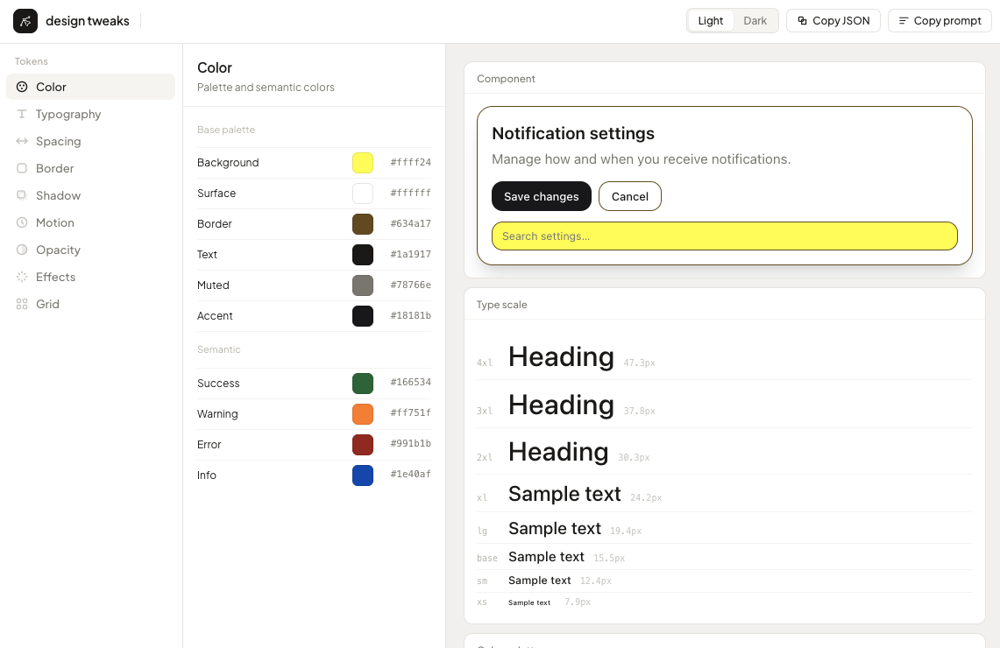

<div align="center">

# design tweaks

**A Claude Code skill — universal visual tweaker**

[](LICENSE)
[](https://claude.ai/code)
[](https://claude.ai/code)
[](SKILL.md)



</div>

---

Open an interactive dashboard-style playground, adjust any visual parameter live, and export exact values back to your codebase. Claude reads your conversation, understands what you're building, asks what it needs, then opens the right explorer — or generates one from scratch.

**Not just design tokens.** Animation timing, icon styles, sound envelopes, component options, color systems — anything with knobs.

---

## How it works

```
/design-tweaks
```

1. Claude reads what you've been building
2. Asks until it has full context
3. Opens the right explorer in your browser
4. Adjust — preview updates live
5. **Copy JSON** or **Copy prompt** → paste back into Claude
6. Claude writes the exact values to your files

---

## What you can tweak

| Subject | Parameters |
|---|---|
| Design tokens | Color, typography, spacing, border, shadow, motion, opacity, blur, grid |
| Animation | Timing curves, spring physics, stagger, durations |
| Iconography | Stroke weight, corner radius, optical sizing, color |
| Component options | Density, shape, color roles, interaction states |
| Sound | Envelope (ADSR), tone, reverb, mix levels |
| Anything else | Claude generates the right controls for the subject |

---

## Export

Both exports include **every parameter with exact values** — no rounding, no omissions.

<details>
<summary>Copy JSON example</summary>

```json
{
  "mode": "light",
  "color": {
    "bg": "#f0f0ee",
    "surface": "#ffffff",
    "border": "#e2e0dc",
    "text": "#1a1917",
    "muted": "#78766e",
    "accent": "#18181b",
    "success": "#166534",
    "warning": "#92400e",
    "error": "#991b1b",
    "info": "#1e40af"
  },
  "typography": {
    "fontBase": "15px",
    "scaleRatio": 1.25,
    "fontFamily": "system",
    "fontWeight": 400,
    "lineHeight": 1.6,
    "letterSpacing": "0em"
  },
  "spacing": { "unit": "4px" },
  "border": { "radius": "10px", "width": "1px", "style": "solid" },
  "shadow": { "level": "sm", "opacity": 0.1 },
  "motion": { "fast": "100ms", "base": "200ms", "slow": "350ms", "easing": "standard" },
  "opacity": { "disabled": 0.38, "overlay": 0.6, "muted": 0.5 },
  "effects": { "blurSm": "4px", "blurMd": "8px", "blurLg": "16px", "backdropBlur": "8px" },
  "grid": { "columns": 12, "gutter": "24px", "margin": "32px" }
}
```

</details>

Paste the output back into Claude and it locates the token files in your project and writes the values directly.

---

## Installation

**Requirements:** [Claude Code](https://claude.ai/code) · Git · macOS

**1. Clone into your skills folder**

```bash
mkdir -p ~/.claude/skills
git clone https://github.com/miguelforero-co/design-tweaks.git ~/.claude/skills/design-tweaks
```

**2. Verify**

```bash
ls ~/.claude/skills/design-tweaks/SKILL.md
```

Should print the path. If it does, the skill is ready.

**3. Use it**

Open any Claude Code session and type `/design-tweaks`.

> First run takes ~2 seconds longer — Google Fonts loads on first open, then caches.

---

## Updating

```bash
cd ~/.claude/skills/design-tweaks && git pull
```

Updates `explorer.html` and `SKILL.md`. Custom tweakers Claude generated for your projects live only on your machine (`dev/` is gitignored) — a pull never touches them.

---

## License

MIT — Miguel Forero, 2026 — see [LICENSE](LICENSE)
